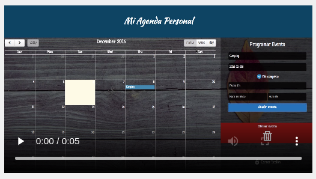
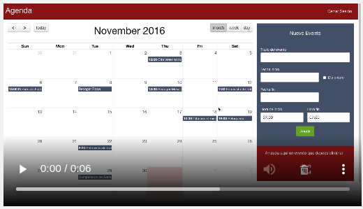

# nuwd7
NextU Proyecto unidad 7 - Bases de datos

## PROYECTO #5 Desarrollo Web:

### Reto Agenda [SQL (PHP-MySQL) & NoSQL (Node.js-MongoDB)]

 

## Carpeta ./NODEJS_MONGODB

  

 

## Carpeta ./PHP_MYSQL

  

  
  
  

